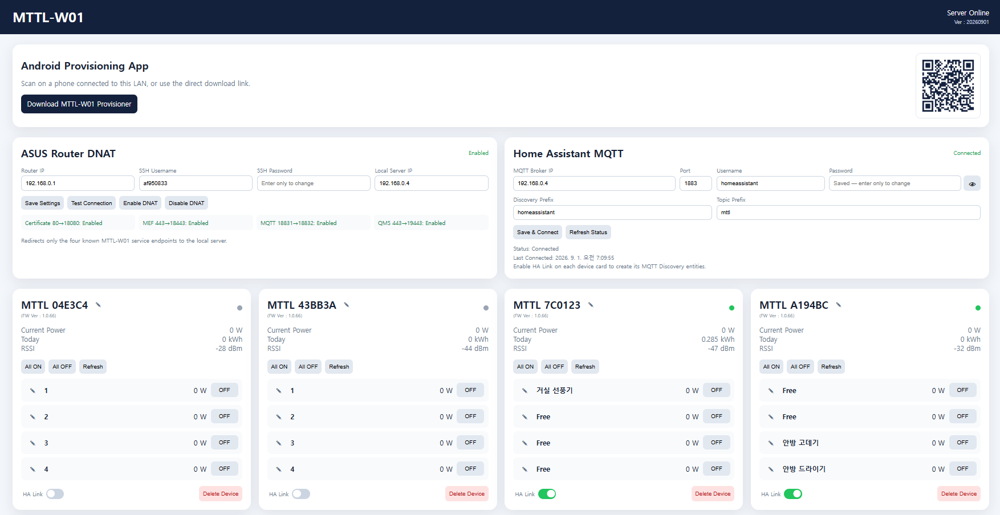
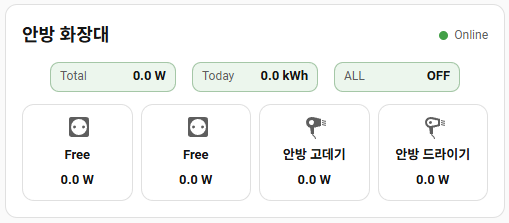

# MTTL-W01 Local Server

[Korean](README.md) | [English](README_EN.md)

A Docker-based local server for using the LG U+ `MTTL-W01` smart power strip on a private network without the manufacturer's cloud.



Main features:

- Device certificate delivery and local MEF enrollment
- Dedicated TLS MQTT server for MTTL-W01 devices
- Multi-device web dashboard
- Master power and individual outlet 1–4 control with power monitoring
- Automatic destination-based DNAT configuration for ASUS routers
- Home Assistant MQTT Discovery integration
- Android provisioning app with a download QR code
- Automatic upgrade of older devices to the official `1.0.66` firmware
- JSON/JSONL file storage without a database

> This is not an official LG U+ project. It is intended for use on a trusted private home network.

## How it works

The power strip attempts to connect to the original manufacturer server IP addresses. Destination NAT on the router redirects only the following four connections to the Docker server.

| Original destination | Local destination | Purpose |
| --- | --- | --- |
| `106.103.210.126:80` | `LOCAL_SERVER_IP:18080` | Local CA download |
| `106.103.210.126:443` | `LOCAL_SERVER_IP:18443` | MEF enrollment and OTA check |
| `106.103.210.119:18831` | `LOCAL_SERVER_IP:18832` | Device TLS MQTT |
| `61.34.165.80:443` | `LOCAL_SERVER_IP:19443` | QMS diagnostic log receiver and success response |

You do not need to assign a fixed IP to each power strip or create per-device DNAT rules. However, other LG U+ IoT devices on the same network that use these destination IP addresses may also be affected.

## Requirements

- An LG U+ MTTL-W01 smart power strip
- An always-on Linux server; Ubuntu 22.04 or 24.04 is recommended
- Docker Engine
- A static address or DHCP reservation for the Linux server
- An ASUS router with SSH enabled
  - The SSH account must be able to run `/usr/sbin/iptables` and `/usr/sbin/conntrack`.
- An Android 10 or later phone
- A 2.4 GHz Wi-Fi SSID and password for the power strip
- An MQTT broker if Home Assistant integration is required

## 1. Check Docker

Skip the installation step if Docker is already available.

```bash
docker version
```

If the current user cannot run Docker, prefix the commands with `sudo` or complete the Docker group configuration.

## 2. Clone the repository

```bash
git clone https://github.com/af950833/mttl_w01.git
cd mttl_w01
```

## 3. Build the Docker image

```bash
docker build -t mttl-local:latest .
```

The image contains the server, web dashboard, Android APK, and official MTTL-W01 `1.0.66` firmware.

## 4. Create persistent directories

The example below uses `/srv/mttl` for persistent data. If you choose a different location, change the paths in all subsequent commands as well.

```bash
sudo mkdir -p /srv/mttl/data /srv/mttl/certs
sudo chown -R 10001:10001 /srv/mttl/data /srv/mttl/certs
```

The service runs as UID `10001` inside the container and needs write access to both directories.

## 5. Generate server certificates

Generate a unique CA and server certificates once for each installation.

```bash
docker run --rm \
  -v /srv/mttl/certs:/certs \
  mttl-local:latest generate-certs
```

Generated files:

- `root-ca.crt`, `root-ca.key`
- `mef.crt`, `mef.key`
- `brk2.crt`, `brk2.key`
- `qms.crt`, `qms.key`

Verify the files:

```bash
sudo ls -l /srv/mttl/certs
```

The command will not overwrite an existing complete certificate set. If the six certificates from an earlier version and `root-ca.key` are present, it adds only `qms.crt` and `qms.key`, signed by the existing CA. It refuses to replace an incomplete base set automatically.

`root-ca.key` is the private key for this installation. Do not upload it to a public repository or shared folder. Back up `/srv/mttl/certs` if you want already-provisioned devices to continue trusting this server.

## 6. Run the container

```bash
docker run -d \
  --name mttl-local \
  --restart unless-stopped \
  --network host \
  -v /srv/mttl/data:/data \
  -v /srv/mttl/certs:/certs:ro \
  mttl-local:latest
```

Check the service:

```bash
docker ps --filter name=mttl-local
docker logs --tail 100 mttl-local
curl http://127.0.0.1:18833/api/health
```

Expected response:

```json
{"status": "ok"}
```

Allow the following TCP ports on the server:

| Port | Purpose |
| ---: | --- |
| `18080` | Device CA download |
| `18443` | TLS MEF enrollment and OTA |
| `18832` | Device TLS MQTT |
| `19443` | QMS TLS diagnostic log receiver |
| `18833` | Web dashboard and REST API |

The UFW commands below are optional and are needed only when UFW is enabled on the server. If `sudo ufw status` reports `inactive`, you do not need to add these rules.

Example UFW rules:

```bash
sudo ufw allow from 192.168.0.0/24 to any port 18080 proto tcp
sudo ufw allow from 192.168.0.0/24 to any port 18443 proto tcp
sudo ufw allow from 192.168.0.0/24 to any port 18832 proto tcp
sudo ufw allow from 192.168.0.0/24 to any port 18833 proto tcp
sudo ufw allow from 192.168.0.0/24 to any port 19443 proto tcp
```

Replace `192.168.0.0/24` with your actual LAN subnet.

## 7. Update the server

After the initial installation, back up the persistent data and run the following commands to update the repository and image.

```bash
cd mttl_w01
git pull
docker build -t mttl-local:latest .
sudo test -s /srv/mttl/certs/root-ca.key
docker run --rm \
  -v /srv/mttl/certs:/certs \
  mttl-local:latest generate-certs
docker stop mttl-local
docker rm mttl-local
docker run -d \
  --name mttl-local \
  --restart unless-stopped \
  --network host \
  -v /srv/mttl/data:/data \
  -v /srv/mttl/certs:/certs:ro \
  mttl-local:latest
```

During an update, the certificate command preserves the existing CA and server certificates and adds only newly required certificates. If the `root-ca.key` check fails, stop and restore the certificate backup. Creating a new CA without the existing private key requires resetting and provisioning the devices again because they do not trust the new CA.

If the DNAT card shows **Partially Enabled** after the update, select **Disable DNAT** and then **Enable DNAT** to install all four rules, including QMS. Devices do not need to be provisioned again when the existing CA has been preserved.

## 8. Open the web dashboard

Open the following URL in a browser:

```text
http://LOCAL_SERVER_IP:18833/
```

For a server at `192.168.0.4`:

```text
http://192.168.0.4:18833/
```

## 9. Configure ASUS Router DNAT

Enable SSH in the ASUS router administration page. Enter the following values in the **ASUS Router DNAT** card on the dashboard:

- **Router IP**: the LAN address of the router
- **SSH Username**: the router SSH username
- **SSH Password**: the router SSH password
- **Local Server IP**: the LAN address of the Docker server

Configuration sequence:

1. Select **Save Settings**.
2. Select **Test Connection** to verify SSH, `iptables`, and `conntrack`.
3. Select **Enable DNAT** to install the four redirect rules.
4. Confirm that the card shows **Enabled** and that all four rules are enabled.

The server creates a separate `MTTL_DNAT` NAT chain and clears matching conntrack entries. The router password is stored in `/data/router-dnat.json` with mode `0600` and is never returned by the dashboard API.

Select **Disable DNAT** when you need to reconnect a device to the manufacturer server or no longer need the redirects.

### Configure DNAT manually on an ASUS router

If you do not want the dashboard to manage DNAT, connect to the ASUS router over SSH and add the rules manually. This example uses `192.168.0.4` as the local server address. Change the first line if necessary.

```sh
LOCAL_SERVER_IP=192.168.0.4

/usr/sbin/iptables -t nat -N MTTL_DNAT
/usr/sbin/iptables -t nat -I PREROUTING 1 -j MTTL_DNAT
/usr/sbin/iptables -t nat -A MTTL_DNAT -d 106.103.210.126/32 -p tcp --dport 80 -j DNAT --to-destination ${LOCAL_SERVER_IP}:18080
/usr/sbin/iptables -t nat -A MTTL_DNAT -d 106.103.210.126/32 -p tcp --dport 443 -j DNAT --to-destination ${LOCAL_SERVER_IP}:18443
/usr/sbin/iptables -t nat -A MTTL_DNAT -d 106.103.210.119/32 -p tcp --dport 18831 -j DNAT --to-destination ${LOCAL_SERVER_IP}:18832
/usr/sbin/iptables -t nat -A MTTL_DNAT -d 61.34.165.80/32 -p tcp --dport 443 -j DNAT --to-destination ${LOCAL_SERVER_IP}:19443

/usr/sbin/conntrack -D -d 106.103.210.126 -p tcp --dport 80
/usr/sbin/conntrack -D -d 106.103.210.126 -p tcp --dport 443
/usr/sbin/conntrack -D -d 106.103.210.119 -p tcp --dport 18831
/usr/sbin/conntrack -D -d 61.34.165.80 -p tcp --dport 443
```

Check the rules:

```sh
/usr/sbin/iptables -t nat -nL MTTL_DNAT -v
```

Remove the manual rules:

```sh
/usr/sbin/iptables -t nat -D PREROUTING -j MTTL_DNAT
/usr/sbin/iptables -t nat -F MTTL_DNAT
/usr/sbin/iptables -t nat -X MTTL_DNAT

/usr/sbin/conntrack -D -d 106.103.210.126 -p tcp --dport 80
/usr/sbin/conntrack -D -d 106.103.210.126 -p tcp --dport 443
/usr/sbin/conntrack -D -d 106.103.210.119 -p tcp --dport 18831
/usr/sbin/conntrack -D -d 61.34.165.80 -p tcp --dport 443
```

The creation commands assume an empty initial state. Repeating them can duplicate rules or produce a `Chain already exists` error. Do not use manual rules and dashboard management at the same time. Manually added rules may disappear after a router reboot. If persistent rules are required, use the appropriate startup mechanism for your firmware, such as an ASUSWRT-Merlin firewall-start script.

Routers from other manufacturers are not configured automatically by this project. Users must implement the four **destination IP and destination port based DNAT rules** using their router's policy NAT or firewall features. Ordinary inbound Internet port forwarding is not sufficient; the router must redirect traffic that a LAN client sends to the specified Internet IP addresses.

## 10. Install the Android provisioning app

Scan the QR code at the top of the dashboard or download the APK from:

```text
http://LOCAL_SERVER_IP:18833/downloads/MTTL-W01-Provisioner.apk
```

It can also be downloaded directly from GitHub:

- [MTTL-W01 Provisioner APK](web/downloads/MTTL-W01-Provisioner.apk)

If Android displays a warning, temporarily allow **Install unknown apps** for the browser or file manager. Also grant the location or nearby-device permission required for Wi-Fi scanning.

This APK can provision the power strip without the manufacturer's **U+ Smart Home** app.

Users who do not trust the supplied APK may install the manufacturer app, create an account, and provision the device with that app instead. However, the manufacturer app requires identity verification through a South Korean mobile phone number. The supplied APK is therefore recommended for international users who do not have access to a South Korean number.

## 11. Provision a power strip

Enable DNAT and verify that the Docker server is running before provisioning.

1. Hold the main button on the power strip for about 10 seconds until the status LED flashes rapidly.
2. Wait for a setup network named `TONLY_TAP_XXXXXXX` to appear.
3. Select **SCAN WI-FI Network** in the app.
4. Select the 2.4 GHz network under **Home Wi-Fi SSID**.
5. Enter its password under **Home Wi-Fi password**.
6. Select the power strip setup network and press **Provision**.
7. Approve the Android Wi-Fi connection request if it appears.
8. Wait for **Provision Success** and **You can close this APP** in the app log.
9. Wait while the device reboots automatically and connects to the home Wi-Fi network.
10. Confirm that a new card appears on the dashboard and that the device status LED stops flashing.

The app derives the setup-network password in the form `LGU_XXXXXXX` from the last seven characters of the AP name. It sends the home Wi-Fi credentials directly to local port `30300` on the power strip.

Deleting only the dashboard card does not deprovision the device. The card can reappear when the device reconnects. To remove the device completely, reset the power strip first and then delete its card.

## 12. Dashboard features

- Edit the device and outlet names
- Control master power and outlets 1–4
- View total and per-outlet current power
- View Today usage
- View firmware version and online status
- Enable or disable **HA Link**
- Delete a device card

An inactive device is marked offline after approximately 45 seconds. The dashboard refreshes approximately every five seconds.

## 13. Home Assistant MQTT integration

Home Assistant must already have an MQTT integration and an accessible MQTT broker. Enter the following values in the **Home Assistant MQTT** card:

- **MQTT Broker IP**: LAN address of the MQTT broker
- **Port**: default `1883`
- **Username / Password**: MQTT broker credentials
- **Discovery Prefix**: default `homeassistant`
- **Topic Prefix**: default `mttl`

Select **Save & Connect** and confirm `Status: Connected`. Enable **HA Link** on each device card to publish its MQTT Discovery entities.

Default entity IDs for a device whose final seven MAC characters are `97C0123`:

```text
switch.mttl_97c0123_all
switch.mttl_97c0123_sw1
switch.mttl_97c0123_sw2
switch.mttl_97c0123_sw3
switch.mttl_97c0123_sw4

sensor.mttl_97c0123_powerall
sensor.mttl_97c0123_power1
sensor.mttl_97c0123_power2
sensor.mttl_97c0123_power3
sensor.mttl_97c0123_power4
sensor.mttl_97c0123_today_usage
```

The master switch is displayed as `SW All`, and the daily energy sensor is displayed as `Today Usage`. Online status is sent through MQTT availability for each entity instead of a separate sensor.

Disabling HA Link publishes MQTT Discovery deletion messages. If Home Assistant is stopped, it may not process them immediately. Disable HA Link while Home Assistant and the broker are running.

### MTTL-W01 Lovelace card

Copy [`ha-card/mttl-w01-card.js`](ha-card/mttl-w01-card.js) to Home Assistant's `/config/www/` directory and register `/local/mttl-w01-card.js` as a JavaScript Module resource. Enter only the final seven MAC characters to automatically arrange total power, Today Usage, the master switch, and four channel buttons with names and live power.

```yaml
type: custom:mttl-w01-card
mac: 97c0123
```



See [`ha-card/README.md`](ha-card/README.md) for installation details and optional settings. Automatic mapping will not work if the default Home Assistant Entity IDs have been changed manually.

## 14. Automatic firmware update

The image includes the unmodified official MTTL-W01 `1.0.66` firmware. When a device reports a version older than `1.0.66` to the local MEF endpoint, the server automatically offers the update. Devices on `1.0.66` or later receive no update offer.

```text
File:   comMTTL-W01_1.0.66.fwr
Size:   327944 bytes
SHA256: d780b578af69d52f3a05191a8e7d91a20e05085a912722327481cd5663682c04
```

Do not disconnect power while an update is in progress. The device may reboot more than once and can take some time to reappear online.

```bash
docker logs -f mttl-local
```

## 15. Data and backups

The server does not use a database. Persistent data is stored under `/srv/mttl/data`.

- Device registration information and names
- Outlet state and power information
- Today usage snapshots
- DNAT and Home Assistant MQTT settings
- Server logs

Back up both directories:

```text
/srv/mttl/data
/srv/mttl/certs
```

If the certificate directory is lost, devices that trust the previous CA may need to be reset and provisioned again.

## 16. Troubleshooting

### The dashboard does not open

```bash
docker ps --filter name=mttl-local
docker logs --tail 200 mttl-local
sudo ss -lntp | grep -E '18080|18443|18832|18833|19443'
curl http://127.0.0.1:18833/api/health
```

### The container stops with a certificate error

If the log contains `missing certificate files`, verify the files and mount path under `/srv/mttl/certs`, then run the certificate command in step 5.

### The DNAT test fails

- Verify that SSH is enabled and the router credentials are correct.
- Verify that `/usr/sbin/iptables --version` runs on the router.
- Verify that `/usr/sbin/conntrack` exists on the router.
- Confirm that the Docker server IP has not changed.
- Confirm that the router and server can reach each other on the LAN.

### The device remains offline after provisioning

- Confirm that all four DNAT entries are enabled.
- Confirm that the power strip is using 2.4 GHz Wi-Fi.
- Allow ports `18080`, `18443`, `18832`, and `19443` through the server firewall.
- Run `docker logs -f mttl-local`, then reconnect power to the device.
- The current firmware's local command format cannot use a colon (`:`) in the SSID or password.

### Home Assistant entities do not appear

- Confirm that the Home Assistant MQTT card reports `Connected`.
- Enable HA Link on the device card.
- Confirm that the Discovery Prefix matches the Home Assistant configuration.
- Confirm that the MQTT account can publish and subscribe to the Discovery and `mttl/#` topics.

## Security notes

- Do not expose the unauthenticated web dashboard directly to the Internet.
- Restrict permissions on the data directory because it stores router and MQTT credentials.
- Never commit a generated CA private key to the repository.
- Enabling DNAT redirects traffic for the specified manufacturer destinations to the local server.

## Current versions

| Component | Version |
| --- | --- |
| Local server and web dashboard | `20260901` |
| Android Provisioner | `0.3.2` (`versionCode 14`) |
| Bundled MTTL-W01 firmware | `1.0.66` |

## Version history

### `20260901`

- Added a local QMS HTTPS receiver that returns an empty `HTTP 200` response
- Integrated QMS destination `61.34.165.80:443` as the fourth ASUS Router DNAT rule
- Extended certificate generation to add only `qms.crt` and `qms.key` using the existing `root-ca.key`
- Added an update path that preserves the existing CA and device provisioning
- Improved MQTT command handling and connection-state reliability
- Added SSE live updates for web, physical-button, and Home Assistant state changes
- Added an MTTL-W01 Lovelace card configured with only the final seven MAC characters
- Added a visual editor for the MTTL-W01 card

### `20260831`

- Initial public release of the MTTL-W01 local server and card-based web dashboard
- Added all/channel control, device state, power, and Today Usage display
- Added Home Assistant MQTT Discovery and per-device HA Link
- Added automatic destination-based DNAT management for ASUS routers
- Included Android Provisioner `0.3.2` with QR/APK download
- Included official MTTL-W01 firmware `1.0.66` for OTA updates
