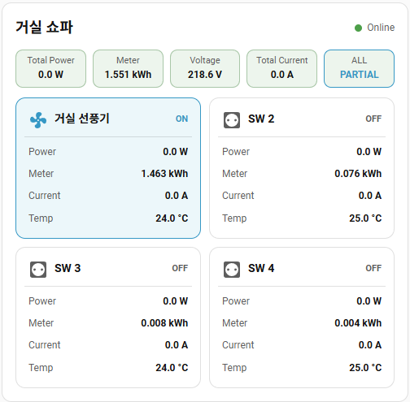

# MTTL-W01 Home Assistant Card

[Korean](README.md) | [English](README_EN.md)

These Lovelace cards automatically connect the master switch, four channel switches, and sensors by entering only the final seven characters of an MTTL-W01 MAC address.

- `mttl-w01-card.js`: default card for stock firmware `1.0.66`
- `mttl-w01-1.0.68-card.js`: extended card for firmware `1.0.68`, adding voltage, total current, and per-channel energy, current, and temperature

Default card for `1.0.66`:


Extended-sensor card for `1.0.68`:



## Installation

1. Copy `mttl-w01-card.js` to Home Assistant's `/config/www/` directory.
2. In Home Assistant, open **Settings → Dashboards → Resources**.
3. Register `/local/mttl-w01-card.js` as a **JavaScript Module**.
4. Refresh the browser cache.

For the extended `1.0.68` card, copy `mttl-w01-1.0.68-card.js` and separately register `/local/mttl-w01-1.0.68-card.js` as a JavaScript Module.

The Home Assistant visual editor lets you configure the final seven MAC characters, card name, channel names, and channel icons. The default `1.0.66` card also provides an option to keep all four channels in one row on mobile.

On the default `1.0.66` card, briefly press a channel button to toggle it or hold it for approximately 0.6 seconds to open the channel power sensor's more-info dialog. On the `1.0.68` card, use the channel header to toggle power and press a Power, Meter, Current, or Temperature row to open that sensor's more-info dialog.

## Usage

Default `1.0.66` card:

```yaml
type: custom:mttl-w01-card
mac: 97c0123
```

Extended `1.0.68` card:

```yaml
type: custom:mttl-w01-1-0-68-card
mac: 97c0123
mobile_two_rows: true
```

Optional settings for the default card:

```yaml
type: custom:mttl-w01-card
mac: 97c0123
name: Living Room Power Strip
compact: false
```

- `mac`: final seven characters of the MAC address. Separators and letter case are normalized automatically.
- `name`: custom card title. When omitted, the card displays `MTTL XXXXXXX`.
- `channel_names`: optional list of four custom channel names.
- `channel_icons`: optional list of four Material Design icon names.
- `compact`: on the `1.0.66` card, set this to `true` to keep all four channels in one row on narrow screens. The default mobile layout is 2×2.
- `mobile_two_rows`: on the `1.0.68` card, set this to `true` to retain a two-column, two-row channel layout on mobile. The default mobile layout is one column.

The default Entity IDs must remain unchanged. For example, a device whose final seven MAC characters are `97C0123` uses `switch.mttl_97c0123_sw1` and `sensor.mttl_97c0123_power1`. Automatic mapping will not work if these Entity IDs have been changed manually in Home Assistant.
